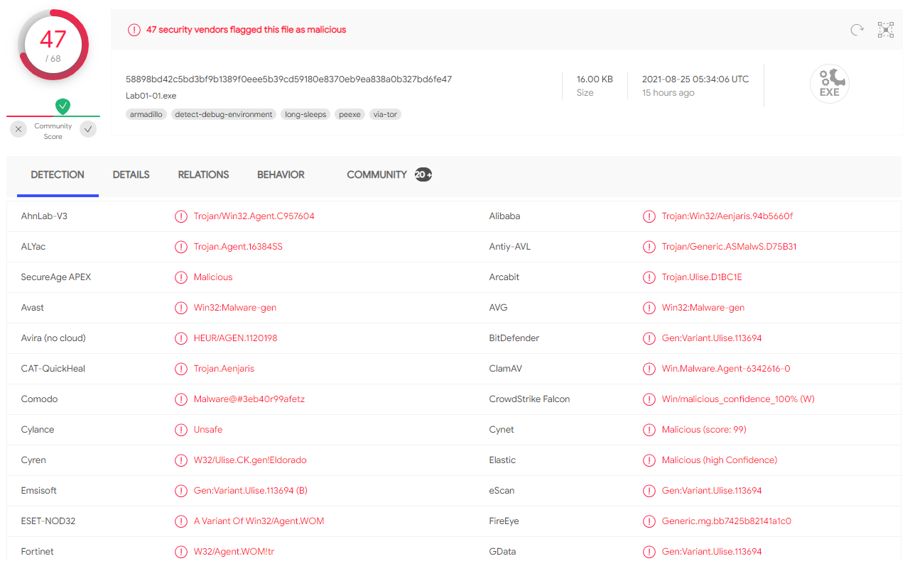
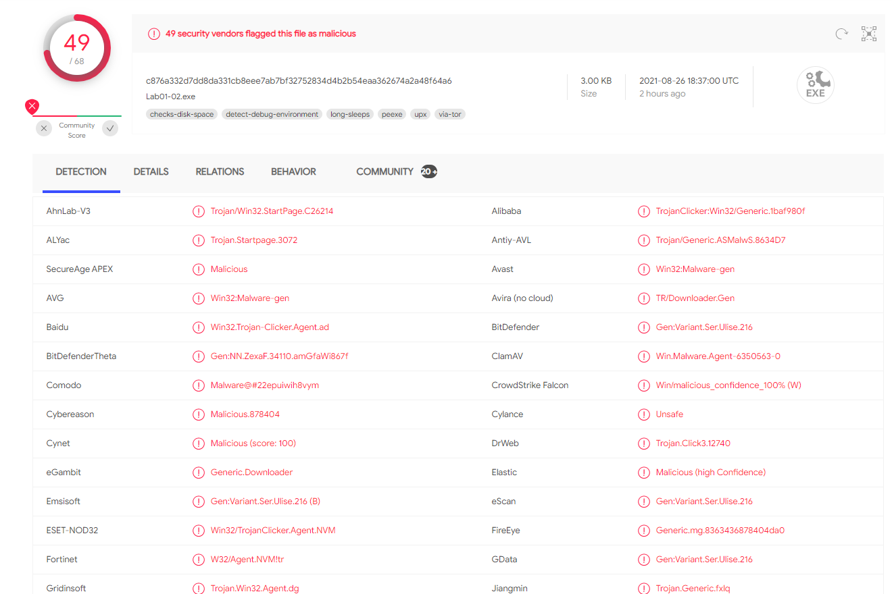
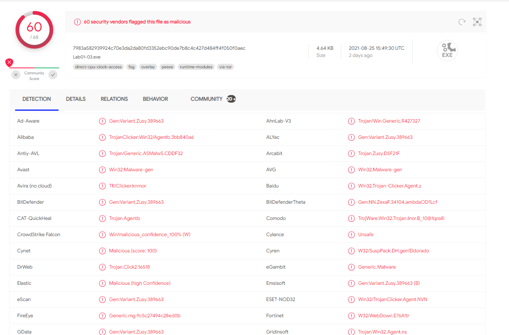
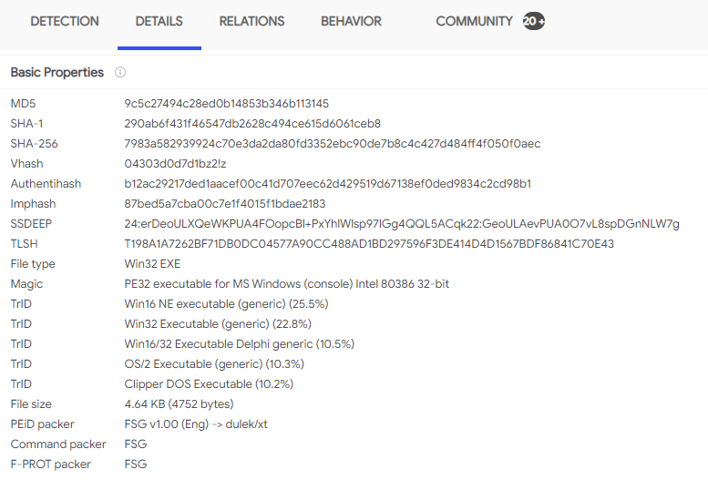
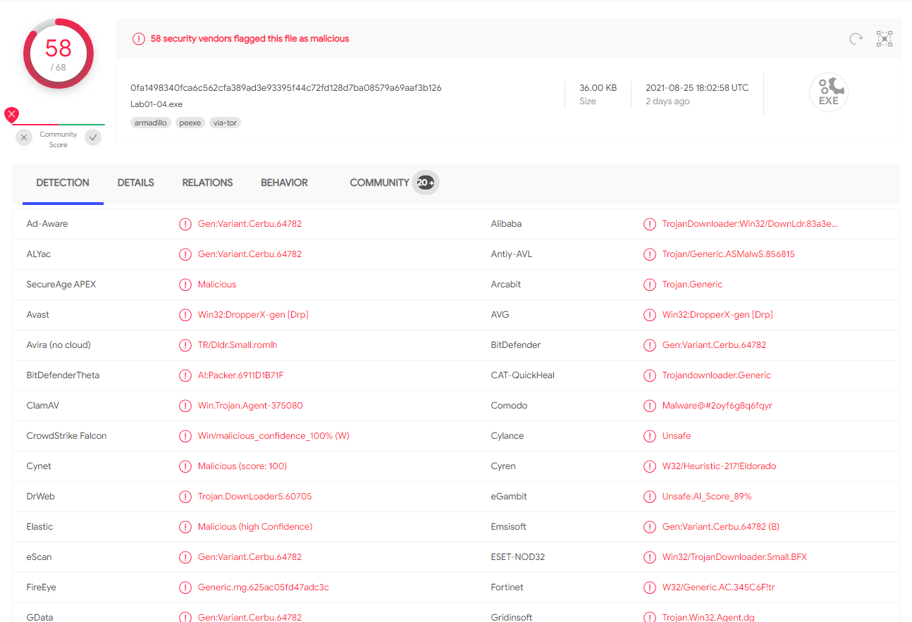

# Chapter 1: Basic Static Techniques
## Learning Points
* Run malware files against various anti-virus programs
  * Websites like [Virus Total](https://www.virustotal.com)
  * Runs against many virus databases
* Calculate MD5, SHA-1 or SHA-256 hashes
  * File hash can be a recognisable signature
  * Search with hash on [Virus Total](https://www.virustotal.com)
* Search for strings in the file
  * Strings can give hints as to what the program can do
  * `strings` program is available for both Linux and Windows (from [Sysinternals](https://docs.microsoft.com/en-us/sysinternals/))
  * May include ASCII and Unicode strings
  * Look for function names, DLL names, error messages, etc.
* Packed and Obfuscated Malware
  * Packed malware has small unpacker code with actual code in archive
    * Used to hide code's intent
    * Used to hide malware signature
    * String search gives few results
    * Few (or no) function names in header
    * Can be detected with [PEiD](https://www.softpedia.com/get/Programming/Packers-Crypters-Protectors/PEiD-updated.shtml) software
    * However, PEiD is a little out of date. Consider other tools ([Yara](https://virustotal.github.io/yara/) maybe?)
  * Obfuscated malware hides the code from easy viewing
  * Packing and obfuscation discussed in detail in later chapters
* Portable Executable File Format
  * The PE file format is used for Windows executables
  * PE files include a header which is of great value
    * Information about code
    * Type of application
    * External required library functions
    * Space requirements
    * DLLs needed 
  * Can be investigated using [PEView](http://wjradburn.com/software/)
* Linked Libraries and Functions
  * List of imported functions is useful as it can indicate what malware does
  * Different types of linking
    * Static - all functions are included in the code
    * Runtime -functions linked only when needed
      * Popular in malware
    * Dynamic - functions linked when the program starts
  * The PE header stores information about the functions
  * You can investigate DLLs with [Dependency Walker](https://www.dependencywalker.com/)
  * Can have both imported and exported functions from the PE
## Tools
* [Dependency Walker](https://www.dependencywalker.com/): View dependencies (DLLs, etc.) for a given binary file
* [Detect It Easy](https://horsicq.github.io/): Detects signatures for packers, amongst other things (**Note:** I used [Chocolatey](https://community.chocolatey.org/) to install this).
* [FileAlyzer](https://www.safer-networking.org/products/filealyzer/): View PE file headers, amongst lots of other stuff
* [PEBrowse Professional](https://download.cnet.com/PEBrowse-Professional-64-bit/3000-2218_4-75176627.html): Browse the headers of PE files
* [PE Explorer](http://www.heaventools.com/): PE file explorer and disassembler
* [PEiD](https://www.aldeid.com/wiki/PEiD): Check for packers in an executable (a little out of date - unable to find databases - maybe use [YARA](https://virustotal.github.io/yara/)
* [PEView](http://wjradburn.com/software/): View PE file headers
* [Resource Hacker](http://www.angusj.com/resourcehacker/): View the various sections of a PE file
* [Strings](https://docs.microsoft.com/en-us/sysinternals/downloads/strings): Displays strings in a file (ASCII and Unicode)
* [upx](https://upx.github.io/): Packer/unpacker for executables.
* [Virus Total](https://www.virustotal.com): Website that runs executables or other signatures (MD5, SHA-1, SHA-256, etc) through many AV databases
* [WinMD5](https://www.winmd5.com/): Create MD5 sums with GUI
## Labs
*Disclaimer: These are my answers to the questions, and may not be completely correct. If answers are wrong (against the book's answers) I have placed a note to say so, but I haven't added extra information if mine are roughly correct. You should read the book's answers!*
### Lab 1-1
**Files:** Lab01-01.exe, Lab01-01.dll
#### Questions and answers
1. Upload the files to http://www.VirusTotal.com/ and view the reports. Does either file match any existing antivirus signatures?
> The exe file matched against 47 of the 68 AV engines, and the DLL matched against 40:
> 
> 
>
> __Note__: The answer in the book is that it gives no matches, but the scanners must have been updated to include a signature for these since the book was published.

2. When were these files compiled?
> I used [FileAlyzer](https://www.safer-networking.org/products/filealyzer/) to look at the PE files. In the PE header tab the date for the exe was shown as `2010-12-19 17:16:19` local time. The DLL showed a time a few seconds later.

3. Are there any indications that either of these files is packed or obfuscated? If so, what are these indicators?
>  I couldn't find any indication (based on what I learnt in this chapter) that the code was packed or obfuscated.

4. Do any imports hint at what the malware does? If so, which imports are they?
> The exe file list of imports shows `CreateFileA`, `FindFirstFileA`, `FindNextFileA` and `CopyFileA` which suggest the program searches the disk for files and copies them somewhere.
>
> The DLL imports `CreateProcessA` and `Sleep` which may suggest it creates a background process.

5. Are there any other files or host-based indicators that you could look for on infected systems?
> Running `strings` on the exe file mentions the file `C:\Windows\System32\Kernel32.dll`. It also mentions a similarly named file - `C:\windows\system32\kerne132.dll` which replaces the `l` in `kernel` with a `1`.
> This file could be used as a host-based indicator.

6. What network-based indicators could be used to find the malware on infected machines?
> Running `strings` on the dll file reveals two indicators that this may use networking. One is the inclusion of the `WS2_32.dll`, which is the DLL for *Windows Sockets 2*, and the prescence of the IP address,
> `127.26.152.13`. This later indicator could be used to detect network traffic to and from that IP address.

7. What would you guess is the purpose of these files?
> I guess this program installs the DLL as `C:\windows\system32\kerne132.dll` to hide it, and then runs it. The DLL then starts up a network connection to the IP address and allows a hacker to access the infected system, using the DLL as a backdoor.

### Lab 1-2
**Files:** Lab01-02.exe
### Questions and answers
1. Upload Lab01-02.exe to http://www.VirusTotal.com. Does it match any existing antivirus definitions?
> The exe file matched against 49 of the 68 AV engines:
> 
>
> __Note__: The answer in the book is that it gives 3 matches out of 41, but the scanners must have been updated to include signatures for this since the book was published.

2. Are there any indications that either of these files is packed or obfuscated? If so, what are these indicators? If the file is packed, unpack if possible.
> I ran the executable through [Detect It Easy](https://horsicq.github.io/). This suggested that the code was packed with `UPX(3.04)[NRV,best]`. Also, the PE section names (viewed in [FileAlyzer](https://www.safer-networking.org/products/filealyzer/) PE Sections tab) are `UPX0`, `UPX1` and `UPX2`. Finally, the Physical Size of `UPX0` is 0, while the Virtual Size is 0x4000.
>
> I tried unpacking with the [upx](https://upx.github.io/) program:
```
PS D:\dir> upx -d -o .\Lab01-02-decomp.exe .\Lab01-02.exe
                       Ultimate Packer for eXecutables
                          Copyright (C) 1996 - 2020
UPX 3.96w       Markus Oberhumer, Laszlo Molnar & John Reiser   Jan 23rd 2020

        File size         Ratio      Format      Name
   --------------------   ------   -----------   -----------
     16384 <-      3072   18.75%    win32/pe     Lab01-02-decomp.exe

Unpacked 1 file.
PS D:\dir>
```
> This was successful, so I loaded `Lab01-02-decomp.exe` into [FileAlyzer](https://www.safer-networking.org/products/filealyzer/) for further analysis.

3. Do any imports hint at this program's functionality? If so, which imports are they and what do they tell you?
> I looked in [FileAlyzer](https://www.safer-networking.org/products/filealyzer/) for imports for the unpacked file, but it didn't show anything, so I moved to using  [PE Explorer](http://www.heaventools.com/).
>
> This showed 4 DLLs used by the exe - `kernel32.dll`, `advapi32.dll`, `msvcrt.dll` and `wininet.dll`. The interesting functions these contained are:
> * kernel32.dll
>   * CreateThread
>   * CreateWaitableTimer
>   * SetWaitableTimer
> 
> These suggest a program is created that waits a set time before being triggered
> * advapi32.dll
>   * CreateServiceA
>   * StartServiceCtlDispatcherA
>   * OpenSCManagerA
>
> These all suggest that a service is being created by the exe
> * msvrct.dll
>   * General functions of no special interest
> * wininet.dll
>   * InternetOpenA
>   * InternetOpenUrlA
>
> These suggest that an internet URL is opened by the program
>
> In all, it seemed to set up a service that waits around and opens a URL (http://www.malwareanalysisbook.com taken from `strings`) in Internet Explorer 8.0 (also taken from `strings`) after a certain length of time. This could be a Scareware or Phishing malware that send the user to a site to get them to buy something or enter some details.

4.  What host- or network-based indicators could be used to identify this malware on infected machines?
> In the `strings` program, the string `MalService` appears. This is likely the name of a service that you could look for running on an infected machine.
>
> __Note__: While I got all the bits and pieces, I didn't mention that you should monitor traffic to the above web address on the infected machine.

### Lab 1-3
**Files:** Lab01-03.exe
### Questions and answers
1. Upload Lab01-03.exe to http://www.VirusTotal.com. Does it match any existing antivirus definitions?
> The exe file matched against 60 of the 68 AV engines:
> 
>
> __Note__: The answer in the book is that it gives 25 matches out of 43, but the scanners must have been updated to include signatures for this since the book was published.

2. Are there any indications that either of these files is packed or obfuscated? If so, what are these indicators? If the file is packed, unpack if possible.
> I ran the executable through [Detect It Easy](https://horsicq.github.io/). This suggested that the code was packed with `FSG(1.0)[-]`. Also, the PE section names (viewed in [PE Explorer](http://www.heaventools.com/)) are blank. Finally, the Physical Size of the unnamed sections are much smaller than the Virtual Size.
>
> Looking at FSG, this seemed quite complicated to unpack, and wasn't discussed in this chapter, so I didn't unpack it.
>
> [Virus Total](http://www.VirusTotal.com) also shows the packer in its *Details* tab:
> 
>
> __Note__: The book also said that this can't be unpacked at this time.

3. Do any imports hint at this program's functionality? If so, which imports are they and what do they tell you?
> The only imports I could find were `LoadLibraryA` and `GetProcAddress`, neither of which hint at anything.

4. What host- or network-based indicators could be used to identify this malware on infected machines?
> There are no indicators in the file. This is probably due to it being packed.

### Lab 1-4
**Files:** Lab01-04.exe
### Questions and answers
1. Upload Lab01-04.exe to http://www.VirusTotal.com. Does it match any existing antivirus definitions?
> The exe file matched against 58 of the 68 AV engines:
> 
>
> __Note__: The answer in the book is that it gives 16 matches out of 43, but the scanners must have been updated to include signatures for this since the book was published.

2. Are there any indications that either of these files is packed or obfuscated? If so, what are these indicators? If the file is packed, unpack if possible.
> I opened the executable in [Detect It Easy](https://horsicq.github.io/), which had no indications that the program was packed.

3. When was this program compiled?
> The creation (compilation) date is also shown in [Detect It Easy](https://horsicq.github.io/). 
> The program was compiled on 2019-08-30 at 22:26:59. This was confirmed by opening it up in [PE Explorer](http://www.heaventools.com/) and looking at the PE Headers.

4. Do any imports hint at this program's functionality? If so, which imports are they and what do they tell you?
> I used [PE Explorer](http://www.heaventools.com/) to look at the inports.
>
> This showed 3 DLLs used by the exe - `kernel32.dll`, `advapi32.dll`, and `msvcrt.dll`. The interesting functions these contained are:
> * kernel32.dll
>   * WinExec
>   * WriteFile
>   * CreateFileA
>   * GetWindowsDirectoryA
>   * MoveFileA
> 
> These suggest a malware file is written to the Windows directory (possibly replacing a genuine file hence MoveFileA), and then executed.
> * advapi32.dll
>   * LookupPrivilegeValueA
>   * AdjustTokenPrivileges
>
> These all suggest that a user's privileges are adjusted - as new privileges can't be added with AdjustTokenPrivileges (according to the [Microsoft Documentation](https://docs.microsoft.com/en-us/windows/win32/api/securitybaseapi/nf-securitybaseapi-adjusttokenprivileges)) this must be used to disable some privileges for a user.
> * msvrct.dll
>   * General functions of no special interest
>
> This all suggests that a file is put into the Windows directory and executed. This file is probably the malware part of this, so  this is probably a `Dropper` (also suggested by the [Virus Total](http://www.VirusTotal.com result)).
>
> Looking at this exe with `strings` shows an extra DLL (`urlmon.dll`) and a function `URLDownloadToFileA`. As this exe contains a resource, that is probably part of that. Extracting the resource is a later question.

5. What host- or network-based indicators could be used to identify this malware on infected machines?
> Running `strings` over this shows a few things. These seem to be inside the resource. They are paths to exe files `\winup.exe` and `\system32\wupdmgrd.exe`. You should check these files on an infected machine.
>
> `strings` also brought up a URL - http://www.practicalmalwareanalysis.com/updater.exe - which should be monitored for network traffic.

6. This file has one resource in the resource section. Use [Resource Hacker](http://www.angusj.com/resourcehacker/) to examine the resource, and then use it to extract the resource. What can you learn from the resource?
> I used [PE Explorer](http://www.heaventools.com/) rather than [Resource Hacker](http://www.angusj.com/resourcehacker/) to extract the ressource, as [Resource Hacker](http://www.angusj.com/resourcehacker/) caused problems with my AV and Anti-malware software.
>
> I opened the downloaded resource in and this now shows the `urlmon.dll` and `URLDownloadToFileA` function mentioned earlier. This resource is probably put into the Windows directory, and itself downloads another malware file (or updates one) from the `http://www.practicalmalwareanalysis.com/updater.exe ` url.


